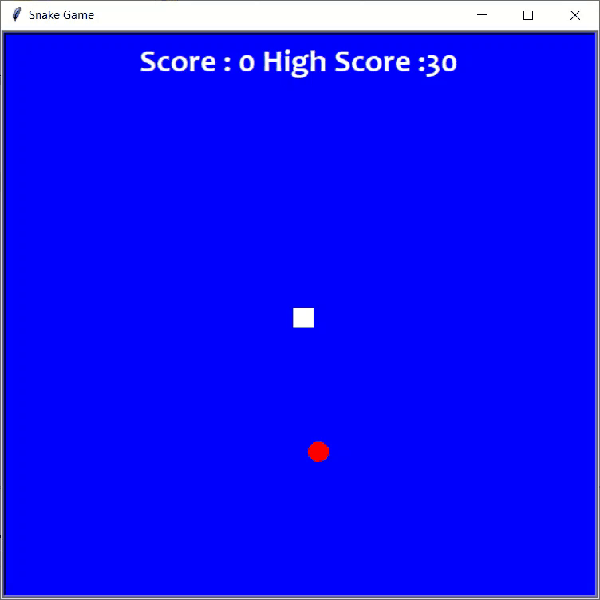

# PySnakeGame Repository

Repository for a Python-based Snake game.

## About

This repository contains PySnakeGame, a Python-based project that brings the classic game of Snake to life. It offers a simple yet engaging gameplay experience where players control a snake to eat food and grow longer, while avoiding collisions with the walls or their own body. Dive into nostalgia and enjoy the excitement of PySnakeGame.

## PySnakeGame Demo



## Features

- Control a snake to eat food and grow longer.
- Avoid collisions with walls and the snake's own body.
- Simple and engaging gameplay.

## Repository Structure

The repository has the following structure:

- `snake.py`: The main Python script for the Snake game.
- `Snake.exe`: Executable file of the Snake game.

## Getting Started

To get started with PySnakeGame, follow these steps:

1. Clone the repository:

   ```bash
   git clone https://github.com/MohamadsalehMoradpoor/PySnakeGame.git
    ```

2. Install the required dependencies. You can find them in the requirements.txt file.

    ```bash
    pip install -r requirements.txt
    ```

3. Run the snake.py script.

    ```bash
    python snake.py
    ```

4. Enjoy the game!

## Requirements

The following dependencies are required to run PySnakeGame:

- Python 3.6+
- Additional dependencies can be found in the requirements.txt file.
Make sure you have these dependencies installed before running the game.

## Contributions

Contributions to this repository are welcome. If you have any ideas or improvements, feel free to open an issue or submit a pull request.